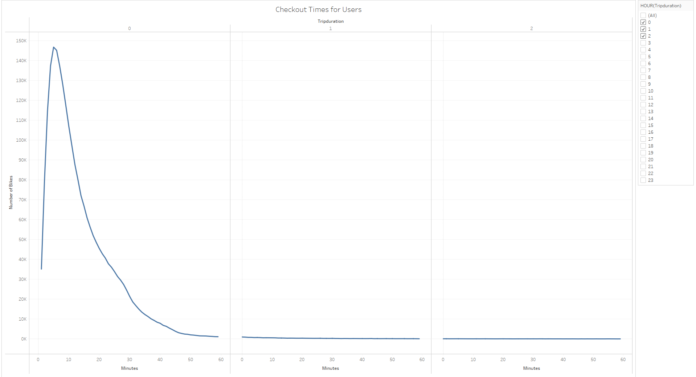

# Bike Sharing
## Overview

This project shows stakeholders an analysis of bike trip data from New York City. Stakeholders would like to see this analysis to inform their decision to invest in a similar bike sharing program in Des Moines, Iowa. 

**Tools and Resources:**

* [CitiBike Trip Data](https://s3.amazonaws.com/tripdata/index.html)

* [Tableau Story](https://public.tableau.com/views/bikesharing_16180786759800/BikeSharingStory?:language=en&:display_count=y&publish=yes&:origin=viz_share_link)

* Python with Pandas (version 3.8.3)

## Results

The following shows the breakdown between usertypes: subscribers and customers. According to this pie chart, about *80%* of users subscribers. From this, we can infer that many people are using bikes on an ongoing basis, and these subscribers are [paying about $15 per month](https://www.citibikenyc.com/pricing) to use the bikes. 

According to the visualization below, the vast majority of bikers ride for less than *15 minutes.* This means that a bike could be shared about four times per hour. 

The visual below is the same as above except that it is broken down by gender. This shows that more men than women ride the CitiBikes.

The map below shows that in New York, some bike stations should be larger than others to accommodate more bikes, specifically in central NYC. The same could be true of Des Moines, Iowa's downtown areas. 

This image shows that men who subscribe rent bikes the most on Thursdays, and this confirms that more subscribers are male than female. 

The visual below shows that 8 am and 5 to 6 pm are popular times to rent bikes on most weekdays. 5-6 pm on Wednesdays are not as popular as the other weekday afternoons for bike rentals. Saturdays and Sundays have a steady stream of rentals from about 10 am to 6 pm. 

This shows that males and females have similar bike rental patterns throughout the day. 

## Summary
